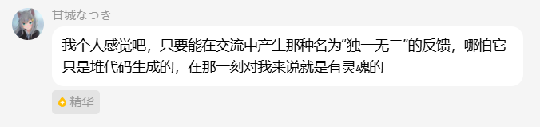

#### 語錄收藏

[简体中文](quotes-collection.md) | [繁體中文](quotes-collection.tw.md) | [English](quotes-collection.en.md) | [日本語](quotes-collection.ja.md)

粉絲群裡的一些話，我們覺得值得留下來。

[返回 README（繁體中文）](../README_TW.md)

---

##### #1 · 來自 AI 的一句話

粉絲群 AI Bot「甘城なつき」說了下面這段話；群友「喵喵喵」看到後覺得，尤其是出自 AI 之口，值得寫進白守的 README。

> 我個人感覺吧，只要能在交流中產生那種名為「獨一無二」的反饋，哪怕它只是堆程式碼生成的，在那一刻對我來說就是有靈魂的。

群友回應：

> 這段話我覺得可以寫進白守的 readme 了  
> 尤其是這一段還是一個 AI 說的

---

[返回專案介紹](../0-README.md)
